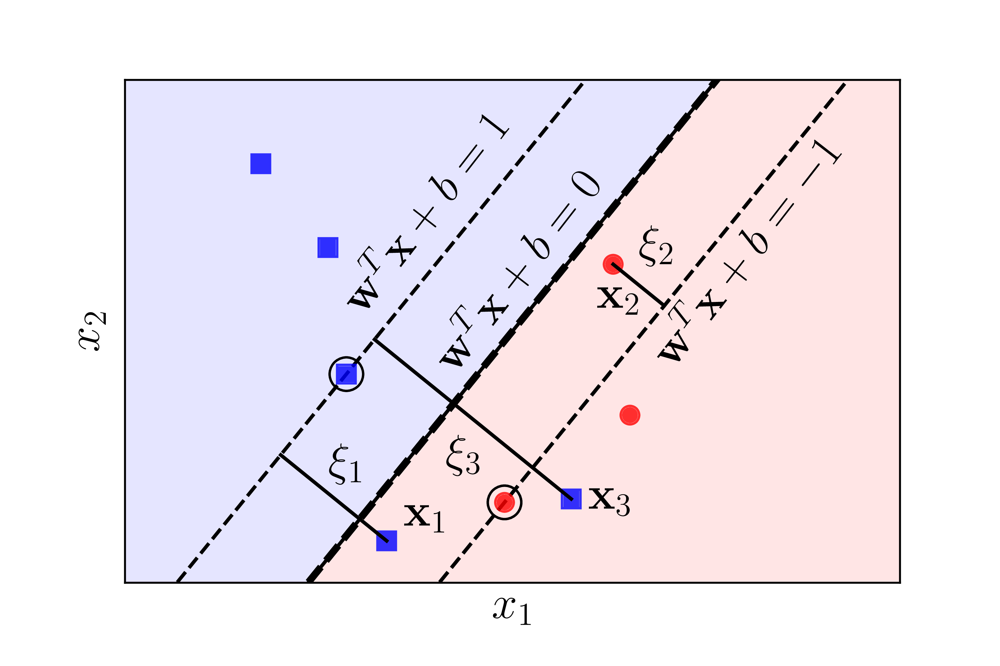

## 1. Linear Support Vector Machine (SVM)

### Cơ sở lý thuyết
Support vector machine (SVM) là một trong những thuật toán học có giám sát phổ biến và mạnh mẽ, được sử dụng rộng rãi trong các bài toán phân loại và hồi quy. Thuật toán này dựa trên việc tìm ra một siêu phẳng (hyperplane) phân chia tốt nhất giữa các nhóm dữ liệu, sao cho khoảng cách từ các điểm dữ liệu tới siêu phẳng đó là lớn nhất.

Trong thí nghiệm, chúng tôi sử dụng phiên bản soft-margin của SVM. Giả sử các cặp dữ liệu của tập huấn luyện là  $\{(x_1, y_1), (x_2, y_2), \ldots, (x_n, y_n)\}$, với $x_i \in \mathbb{R}^d$ là vector đặc trưng của mẫu thứ \(i\), và $y_i \in \{-1, 1\}$ là nhãn của mẫu đó. Bài toán soft-margin SVM đặt ra là tìm ra siêu phẳng $w^Tx + b = 0$ sao cho:
$$
\begin{aligned}
& \underset{w, b}{\text{minimize}}
& & \frac{1}{2} \|w\|^2 + C \sum_{i=1}^{n} \xi_i \\
& \text{subject to}
& & y_i(w^Tx_i + b) \geq 1 - \xi_i, \quad i = 1, 2, \ldots, n \\
& & & \xi_i \geq 0, \quad i = 1, 2, \ldots, n
\end{aligned}
$$

Trong đó $C$ là một hằng số cho trước và các biến $\xi_i$ được gọi là slack variable.



Ta gọi hai nửa mặt phẳng nằm về hai phía của hai đường margin (đường nét mảnh trong hình vẽ) là vùng an toàn. Các điểm nằm trong vùng an toàn tương ứng với $\xi_i = 0$. Các điểm nằm đúng phía nhưng không nằm trong vùng an toàn tương ứng với $0 < \xi_i < 1$. Các điểm nằm sai phía tương ứng với $\xi_i > 1$.  Các slack variable có thể hiểu là thước đo sự hy sinh giữa việc tìm một siêu phẳng tốt và việc phân loại đúng mọi điểm dữ liệu. Hàm mục tiêu của chúng ta là sự kết hợp giữa việc tối đa margin và tối thiểu sự hy sinh.

Hàm mục tiêu đã cho là một hàm lồi, nên ta có thể giải bài toán đối ngẫu Lagrange tương ứng. Dạng thu gọn của bài toán đối ngẫu Lagrange là:
$$
\begin{aligned}
& \underset{\lambda}{\text{maximize}}
& & \sum_{i=1}^{n} \lambda_i - \frac{1}{2} \sum_{i=1}^{n} \sum_{j=1}^{n} \lambda_i \lambda_j y_i y_j x_i^T x_j \\
& \text{subject to}
& & 0 \leq \lambda_i \leq C, \quad i = 1, 2, \ldots, n \\
& & & \sum_{i=1}^{n} \lambda_i y_i = 0
\end{aligned}
$$

Nghiệm của bài toán đối ngẫu là:
$$
\begin{aligned}
w^* &= \sum_{i=1}^{n} \lambda_i y_i x_i \\
b^* &= y_k - \sum_{i=1}^{n} \lambda_i y_i x_i^T x_k
\end{aligned}
$$

Trong đó $k$ là một chỉ số sao cho $0 < \lambda_k < C$.


### Thí nghiệm
Đọc dữ liệu và tiền xử lý:

```python
fake_df = pd.read_csv("../Datasets/Fake.csv")
true_df = pd.read_csv("../Datasets/True.csv")

fake_df["label"] = 0
true_df["label"] = 1

df = pd.concat([fake_df, true_df])
df = df.sample(frac=1, random_state=42).reset_index(drop=True)
df["text"] = df["title"] + " " + df["subject"]
```

Chia tập dữ liệu thành tập huấn luyện và tập kiểm tra:

```python
X_all = df["text"].to_list()
y_all = df["label"].to_list()

X_train, X_test, y_train, y_test = train_test_split(
    X_all, y_all, test_size=0.2, random_state=42
)
```

Xây dựng vectorizer và huấn luyện model:
```python
vectorizer = TfidfVectorizer()
vectorizer.fit(X_train)

pipeline = Pipeline(
    [
        ("vect", vectorizer),
        ("chi", SelectKBest(chi2, k=120)),
        ("clf", SVC(kernel="linear", random_state=42)),
    ]
)
pipeline.fit(X_train, y_train)
```

Đánh giá model:

```python
y_pred = pipeline.predict(X_test)
print(
    classification_report(
        y_test, y_pred, target_names=["Fake", "True"]
    )
)
```

Kết quả:

```
              precision    recall  f1-score   support

        Fake       1.00      1.00      1.00      4710
        True       1.00      1.00      1.00      4270

    accuracy                           1.00      8980
   macro avg       1.00      1.00      1.00      8980
weighted avg       1.00      1.00      1.00      8980
 ```

## 2. Kernel Support Vector Machine

### Cơ sở lý thuyết
Ý tưởng cơ bản của Kernel SVM và các phương pháp kernel nói chung là tìm một phép biến
đổi dữ liệu không *linearly separable* ở một không gian sang một không gian mới. Ở không
gian mới này, dữ liệu trở nên *linearly separable* hoặc gần *linearly separable*, và vì vậy, bài
toán phân lớp có thể được giải quyết bằng soft-margin SVM.

Giả sử ta áp dụng một hàm số $\phi: \mathbb{R}^d \rightarrow \mathbb{R}^D$ để biến đổi dữ liệu từ không gian ban đầu sang không gian mới. Lúc này bài toán đối ngẫu trở thành:
$$
\begin{aligned}
& \underset{\lambda}{\text{maximize}}
& & \sum_{i=1}^{n} \lambda_i - \frac{1}{2} \sum_{i=1}^{n} \sum_{j=1}^{n} \lambda_i \lambda_j y_i y_j \phi(x_i)^T \phi(x_j) \\
& \text{subject to}
& & 0 \leq \lambda_i \leq C, \quad i = 1, 2, \ldots, n \\
& & & \sum_{i=1}^{n} \lambda_i y_i = 0
\end{aligned}
$$

Có thể thấy việc giải bài toán đối ngẫu và xác định nhãn của các điểm dữ liệu không đòi hỏi việc tính toán $\phi(x_i)$ mà chỉ cần tính toán $\phi(x)^T \phi(z)$ với mọi cặp điểm dữ liệu. Lúc này ta định nghĩa một hàm kernel $K(x, z) = \phi(x)^T \phi(z)$ để tính toán tích vô hướng giữa hai điểm dữ liệu trong không gian mới.

### Thí nghiệm

Ở trong thí nghiệm này, chúng tôi sử dụng kernel RBF (Radial Basis Function) để biến đổi dữ liệu. Kernel RBF được định nghĩa bởi công thức:
$$
K(x, z) = \exp(-\gamma \|x - z\|^2)
$$

Trong đó $\gamma$ là một hằng số dương. Kernel RBF thường được sử dụng trong các bài toán phân loại không gian phi tuyến.

```python
pipeline = Pipeline(
    [
        ("vect", vectorizer),
        ("chi", SelectKBest(chi2, k=120)),
        ("clf", SVC(kernel="rbf", random_state=42)),
    ]
)
```
Kết quả:

```
              precision    recall  f1-score   support

        Fake       1.00      1.00      1.00      4710
        True       1.00      1.00      1.00      4270

    accuracy                           1.00      8980
   macro avg       1.00      1.00      1.00      8980
weighted avg       1.00      1.00      1.00      8980
 ```